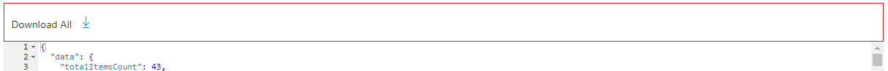
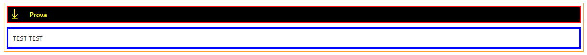
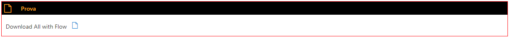

# PnP Modern Search - DG Extention

This project centralizes extensibility code made by my for the [PnP Modern Search solution (v4)](https://github.com/microsoft-search/pnp-modern-search). This project include:

- Custom web components
- Custom Handlebars helpers

This code is from [PnP Modern Search solution (v4)](https://github.com/microsoft-search/pnp-modern-search-extensibility-samples)

## Get Started

- Install and configure the [PnP Modern Search - Extensibility samples](https://microsoft-search.github.io/pnp-modern-search/installation/) in your SharePoint Online environment.

## Web Components

**Demo components:**  
Usati per sperimentare. Non verranno descritti.

- dg-custom-component
- dg-demo-component

**Generic components:**  

- [msys-border](#border-component)
- [msys-title-border](#title-border-componet)
- [msys-css-loader](#css-loader)
- msys-download-all

## Components description

### Border Component

```html
<msys-border 
    data-color="" 
    data-size="" 
    data-hide="" 
    data-class-name="" 
    data-css-url="">
    <template id="border-content">
        {content}
    </template>
</msys-border>
```  

| Property          | Description                                                                                                        |
| ----------------- | ------------------------------------------------------------------------------------------------------------------ |
| `data-color`      | string - codice colore. | Colore del bordo.                                                                        |
| `data-size`       | number - in pixel. Dimensione in pixel del bordo.                                                                  |
| `data-hide`       | boolean - true | false. Nasconde il bordo.                                                                         |
| `data-class-name` | string. Classe assegnata al contenitore principale.                                                                |
| `data-css-url`    | string. Url del file CSS esterno.                                                                                  |
| `template`        | `<template id="border-content">{content}</template>`. Il contenuto.                                                |

#### Examples Border

```html
<msys-border 
    data-color="red" 
    data-size=1 
    data-hide=false 
    >
    <template id="border-content">
        <div class="template--resultCount">
            <msys-download-component data-label="Download All" data-content="{{JSONstringify this 2}}" data-icon="Download"></msys-download-component>
        </div>
    </template>
</msys-border>
```



### Title Border Componet

```html
<msys-title-border 
    data-color="" 
    data-size="" 
    data-hide="" 
    data-hide-title="" 
    data-icon="" 
    data-title="" 
    data-title-bkg-color=""
    data-text-color="" 
    data-class-name="" 
    data-title-class-name="" 
    data-body-class-name="" 
    data-css-url="">
    <template id="border-content">
        {content}
    </template>
</msys-title-border>
```  

| Property          | Description                                                                                                        |
| ----------------- | ------------------------------------------------------------------------------------------------------------------ |
| `data-color`      | string - codice colore. | Colore del bordo.                                                                        |
| `data-size`       | number - in pixel. Dimensione in pixel del bordo.                                                                  |
| `data-hide`       | boolean - true | false. Nasconde il bordo.                                                                         |
| `data-hide-title` | boolean - true | false. Nasconde il titolo.                                                                        |
| `data-icon`       | string - fabric ui icon name. Icona nel titolo.                                                                    |
| `data-title`      | string. Il titolo                                                                                                  |
| `data-title-bkg-color`      | string - codice colore. Sfondo del titolo.                                                               |
| `data-text-color` | string - codice colore. Colore dei caratteri del titolo.                                                           |
| `data-class-name` | string. Classe assegnata al contenitore principale.                                                                |
| `data-title-class-name` | string. Classe assegnata al contenitore del titolo.                                                          |
| `data-body-class-name` | string. Classe assegnata al contenitore del contenuto.                                                        |
| `data-css-url`    | string. Url del file CSS esterno.                                                                                  |
| `template`        | `<template id="border-content">{content}</template>`. Il contenuto.                                                |  

#### Examples Title Border

```html
<style>
    /* Insert your CSS overrides here */
    .test1 {
        margin-bottom: 10px;
        padding: 5px;
        border: orange solid 1px;
    }

    .test2 {
        border: red solid 2px;
    }

    .test3 {
        border: blue solid 3px;
        margin-top: 10px;
    }
</style>
<msys-title-border 
    data-color="red" 
    data-size=1 
    data-hide=true 
    data-hide-title=false
    data-icon="Download" 
    data-title="Prova" 
    data-text-color="yellow" 
    data-title-bkg-color="black"
    data-class-name="test1"
    data-title-class-name="test2"
    data-body-class-name="test3"
    data-css-url=""
    >
    <template id="border-content">
            <div class="template--resultCount">
                TEST TEST                   
        </div>
    </template>
</msys-title-border>
```



```html
<style>
    /* Insert your CSS overrides here */
    .lele1 {
        margin-bottom: 10px;
    }            
</style>
<msys-title-border 
    data-color="red" 
    data-size=1 
    data-hide=false 
    data-hide-title=false
    data-icon="Page" 
    data-title="Prova" 
    data-text-color="orange" 
    data-title-bkg-color="black"
    data-class-name="lele1"
    data-title-class-name="lele2"
    data-body-class-name="lele3"
    data-css-url=""
    >
    <template id="border-content">
        <div class="template--resultCount">
            <msys-invoke-flow-component data-content="{{JSONstringify this 2}}" data-label="Download All with Flow" data-list-settings="Settings" data-settings-key="SPFX_InvokeFlowComponent" data-icon="Page"></msys-invoke-flow-component>
        </div>
    </template>
</msys-title-border>
```



### Css Loader

```html
<msys-css-loader data-css-url=""></msys-css-loader>
```  

| Property          | Description                                                                                                        |
| ----------------- | ------------------------------------------------------------------------------------------------------------------ |
| `data-css-url`    | The web component class for that component.                                                                        |

### Download File

Permette di fare il download di tutti i file contenuti nei risultati della ricerca.

```html
<msys-download-all data-label="Download All" data-content="{{JSONstringify this 2}}" data-icon="Download"></msys-download-all>
```  

| Property          | Description                                                                                                        |
| ----------------- | ------------------------------------------------------------------------------------------------------------------ |
| `data-content`    | Il contesto della search result webpart.                                                                           |
| `data-label`      | Il testo vicino al bottone.                                                                                        |
| `data-icon`       | L'icona del bottone.                                                                                               |

### Invoke Power Automate Flow

Chiama un flow Power Automate con un HTTP Trigger con i seguenti parametri.  

```json
{
    "siteUrl": "<absolute url>",
    "data": "queryText",
    "userEmail": "userEmail"
}
```

```html
<msys-call-flow data-content="{{JSONstringify this 2}}" data-label="Download All with Flow" data-list-settings="Settings" data-settings-key="SPFX_InvokeFlowComponent" data-icon="Page"></msys-call-flow>
```  

| Property                   | Description                                                                                                        |
| -------------------------- | ------------------------------------------------------------------------------------------------------------------ |
| `data-content`             | Il contesto della search result webpart.                                                                           |
| `data-label`               | Il testo vicino al bottone.                                                                                        |
| `data-icon`                | L'icona del bottone.                                                                                               |
| `data-list-settings`       | Il titolo della lista Settings. Deve essere nello stesso sito.                                                     |
| `data-settings-key`        | La chiave di ricerca dell'item della lista Settings.                                                               |

## Heandlebars Helpers  

- cleanText
- getUrl
- getLocateUrl
- getDispUrl

### cleanText

Value is a string

```text
{{cleanText 'value'}}
```  

### getUrl

Mandatory properties: ServerRedirectedURL and Path  

Usage:  

```html
<a href="{{getUrl item}}">
```  

### getLocateUrl

Mandatory properties: ParentLink, SPWebUrl and ListItemID  

Usage:  

```html
<a href="{{getLocateUrl item}}">
```  

### getDispUrl

Mandatory properties: ParentLink, SPWebUrl and ListItemID  

Usage:  

```html
<a href="{{getDispUrl item}}">
```  

## Disclaimer

**THIS CODE IS PROVIDED *AS IS* WITHOUT WARRANTY OF ANY KIND, EITHER EXPRESS OR IMPLIED, INCLUDING ANY IMPLIED WARRANTIES OF FITNESS FOR A PARTICULAR PURPOSE, MERCHANTABILITY, OR NON-INFRINGEMENT.**
